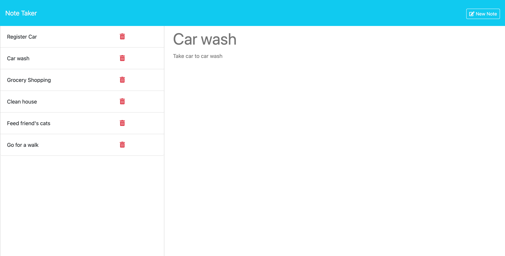

# note-taker

## Description
This project is a note-taker application designed to take and keep track of notes.  Simply click "Get Started" to get started taking notes and keeping track of your to-dos.  On the notes page, you are free to interact with existing notes, write new notes, or delete old ones.  The application uses data persistence to keep track of the notes on refresh, so you can come back to the application at any time and resume right where you left off, and it utilizes Express.js to control the html and api routes between the client and the db.json file.

This was a challenging project for me as I learned to understand and navigate exactly what was happening to the data as it was written and saved and manipulated, and it was difficult at first to understand how the provided front-end code and the back-end code I wrote worked together to display a fully functional application.  It was also a challenge to use modularization and keep my files separate, because I had to have an understanding of what data was being imported and exported across the files and only export the required functions and import them on the applicable pages.

## Table of Contents
* [Installation](#installation)
* [Usage](#usage)
* [License](#license)
* [Contributing](#contributing)
* [Credits](#credits)
* [Tests](#tests)
* [Questions](#questions)

## Installation
Installation instructions for application:
npm i to install express and uuid

## Usage
[Click here](https://note-taker-z0v0.onrender.com/) for deployed application

To use the project navigate to the link above and open the deployed application.  The user will be directed to a landing page with the title of the application and a subtitle indicating the use of express.js.  At the landing page, the user can click on a button to 'Get Started'. Clicking get started navigates the user away from the landing page and brings them to the /notes page.  On the left hand side of the screen will list any existing notes, and in the right column will be a field for Note Title and Note Text. Filling in the Note Title and Note Text fields with your own information about the notes will provide options to save the note or clear the form to start over in the top right hand corner of the screen.  Hitting save note moves your note instantly over to the lefthand column on the screen, and you can enter as many notes as you'd like.  If you'd like to revisit an already written note, click on the title of the note and it will pop up in the main section of the screen.  From here you can either click on other notes to view them, choose to write a new note by clicking the button that appears in the righthand corner of the screen, continue to view the same note, or click the little red garbage can icon to delete any notes in the lefthand side of the screen, including the selected note.  The note will instantly be deleted and you can move on with the rest of your to-do list.

## License
This project is operating under the MIT license.  For more detailed information, please click [here](https://opensource.org/license/mit).

## Contributing
See questions section below for my contact information

## Credits
N/A

## Tests
To run tests for the application:
N/A

## Questions
Contact me for any questions regarding this project:

GitHub: [lindsay-terry](https://github.com/lindsay-terry)

Email: lindsaytee66@gmail.com
